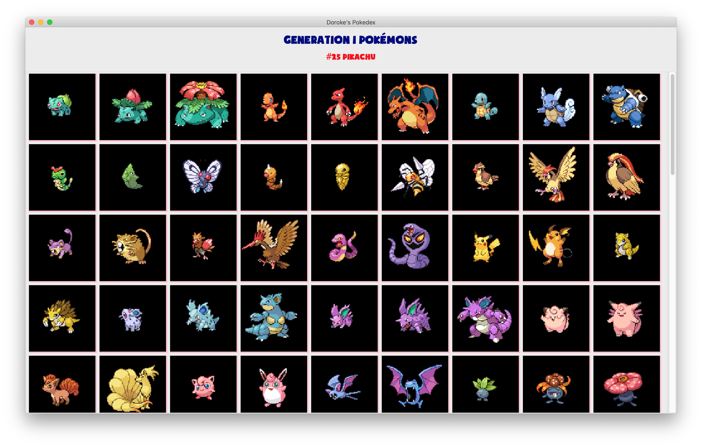
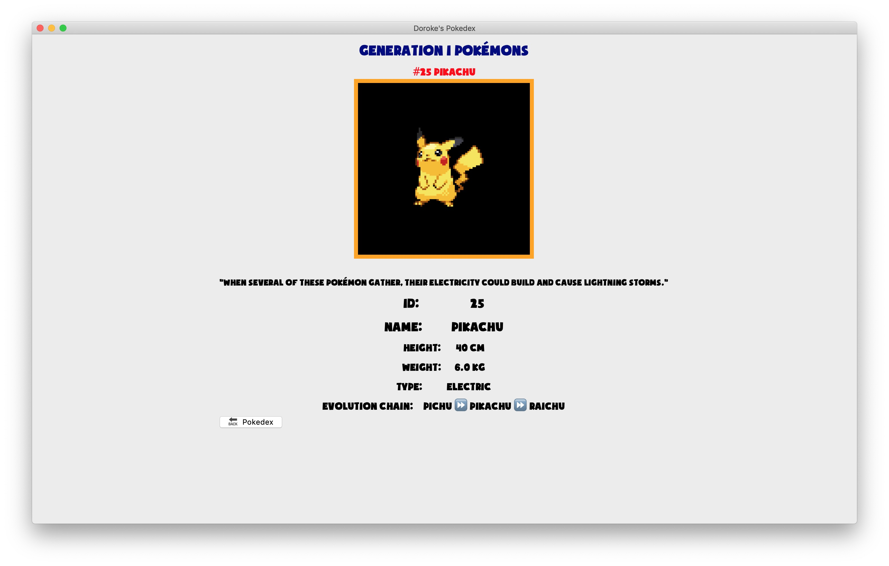
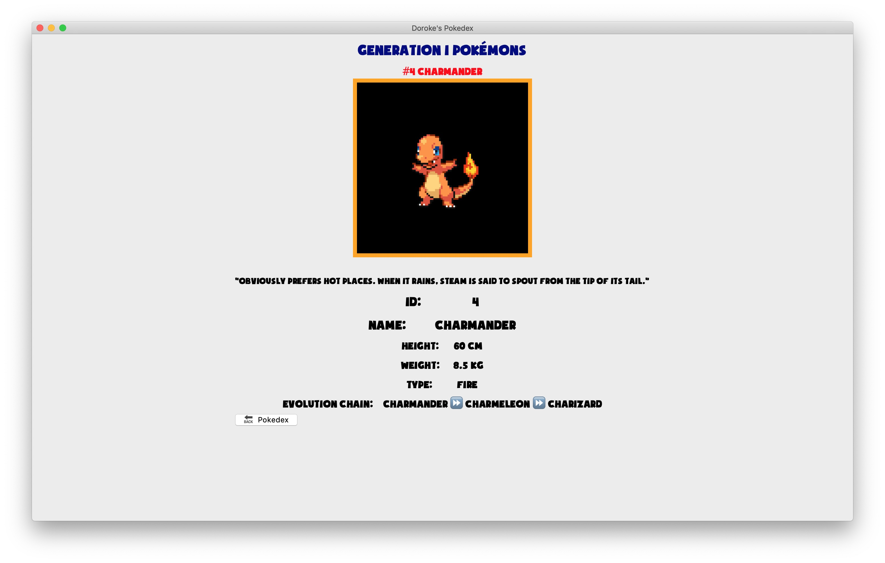

# Pokedex in Tkinter

## About
A simple Pokedex for Generation 1 Pokemons, written in Python and Tkinter

Run the program with `pokedex.py`

This program can also be expanded beyond the first 151 Pokemons from the generation 1. A download utility `download_util.py` script can be found under `data` folder. Simply change the variable `total_pokemon` to a number you wish to rebuild the pokemon database.

## Connect with me
* My [Personal website](https://hoangdesu.com/)
* My [LinkedIn](https://www.linkedin.com/in/hoangdesu/)
* My [Facebook](https://www.facebook.com/Hoangdayo/)
* My [Instagram](https://www.instagram.com/hoang.desu/)
* You can shoot me an [email](mailto:hoangdesu@gmail.com) too

If you find this project helpful, consider dropping me a star ⭐️ !